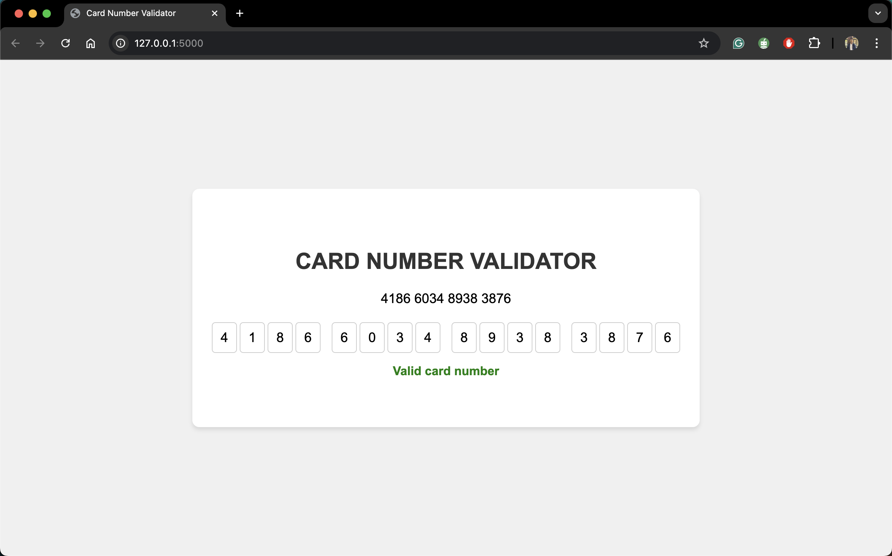
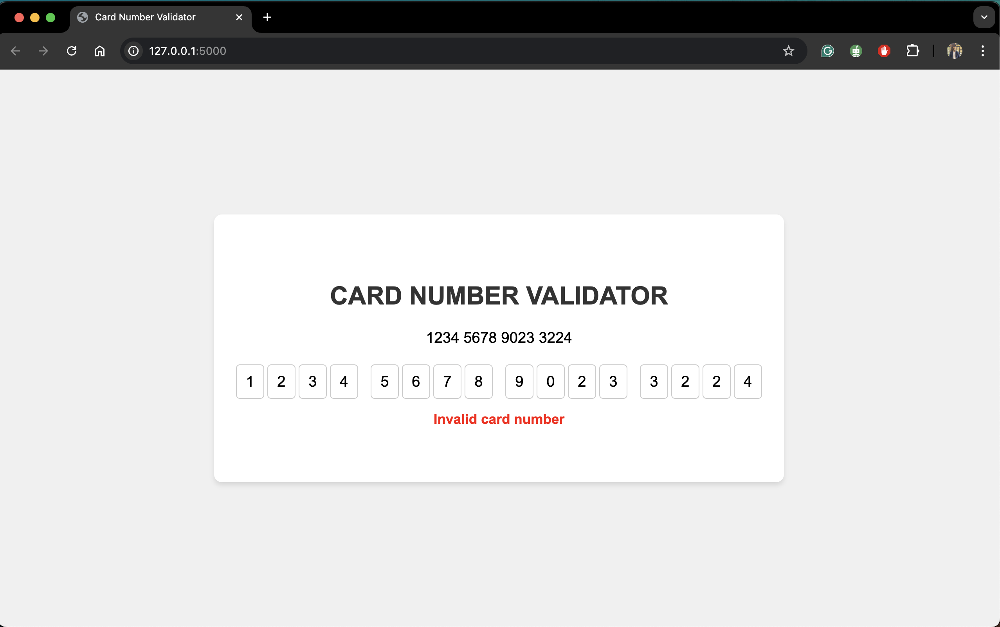

# Card Number Validator

This project is a simple web application that validates credit card numbers using the Luhn algorithm. The application is built with Flask for the backend and uses HTML and CSS for the frontend. Users can input a card number, and the application automatically checks whether the number is valid or not as soon as the input is completed.

## Features

- Real-time validation of card numbers using the Luhn algorithm.
- Basic web interface with HTML and CSS.
- Flask-based backend to handle validation logic.
- User-friendly input form that validates as you type.

## Prerequisites

- Python 3.x
- Flask

## Installation

1. Clone the repository:

    ```bash
    git clone https://github.com/abhi7585/card-number-validator.git
    cd card-number-validator
    ```

2. Set up a virtual environment (optional but recommended):

    ```bash
    python -m venv venv
    source venv/bin/activate  # On Windows use `venv\Scripts\activate`
    ```

3. Install the required packages:

    ```bash
    pip install -r requirements.txt
    ```

4. Run the Flask application:

    ```bash
    python app.py
    ```

5. Open your web browser and go to `http://127.0.0.1:5000` to access the application.

## Usage

1. Enter a card number into the input field on the webpage.
2. The application automatically validates the card number in real time as you type.
3. A message will be displayed indicating whether the card number is valid or not.

## Luhn Algorithm

The Luhn algorithm, also known as the "modulus 10" or "mod 10" algorithm, is a simple checksum formula used to validate various identification numbers, such as credit card numbers. It checks the sum of the digits, doubled every second digit from the right, adjusting for values greater than 9, and checks if the total modulo 10 is equal to 0.

### Example Outputs

- **Correct Card Number:**

  

- **Incorrect Card Number:**

  


## Technologies Used

- **Flask**: Python web framework used for the backend.
- **HTML/CSS**: For the frontend interface.
- **Luhn Algorithm**: Used to validate the card numbers.

## Contributing

Contributions are welcome! Please open an issue or submit a pull request for any changes or enhancements.

## License

This project is open-source and available under the MIT License.

---

Feel free to modify this template to suit your specific project setup and requirements.
